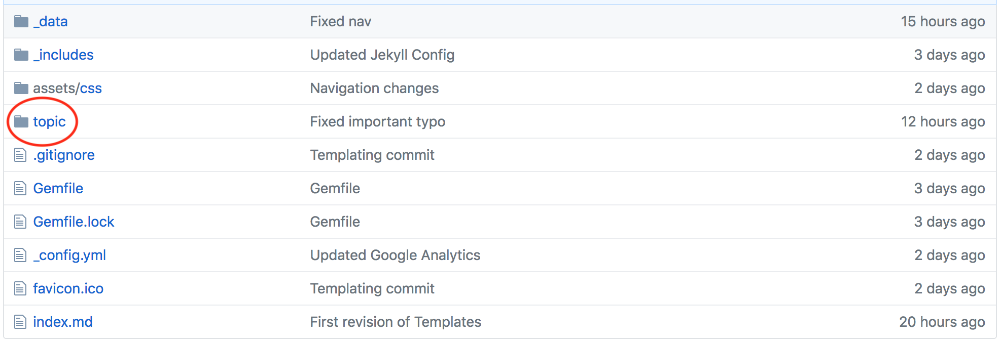
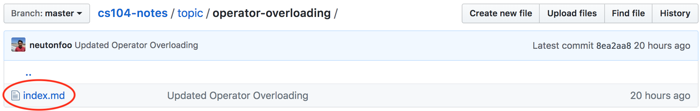
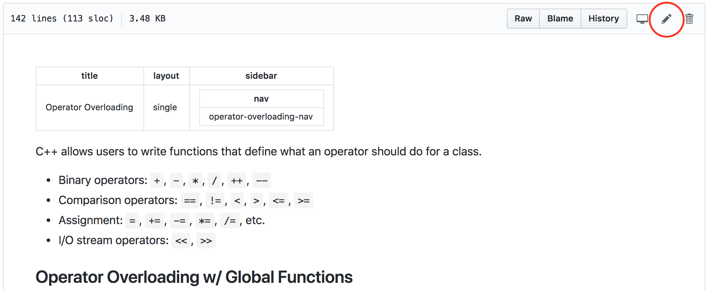
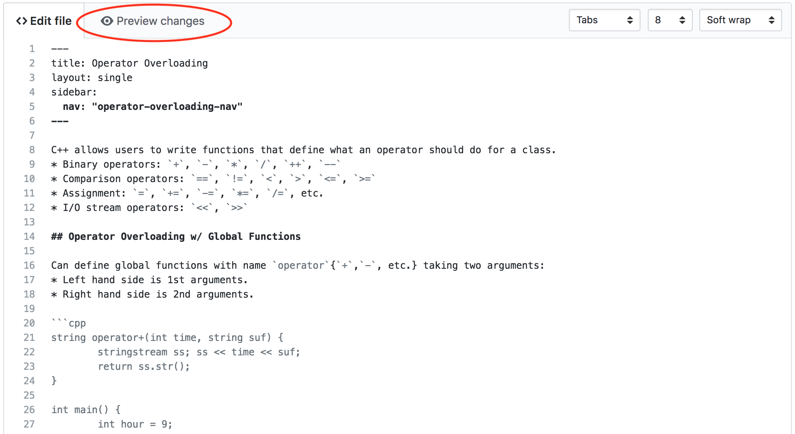
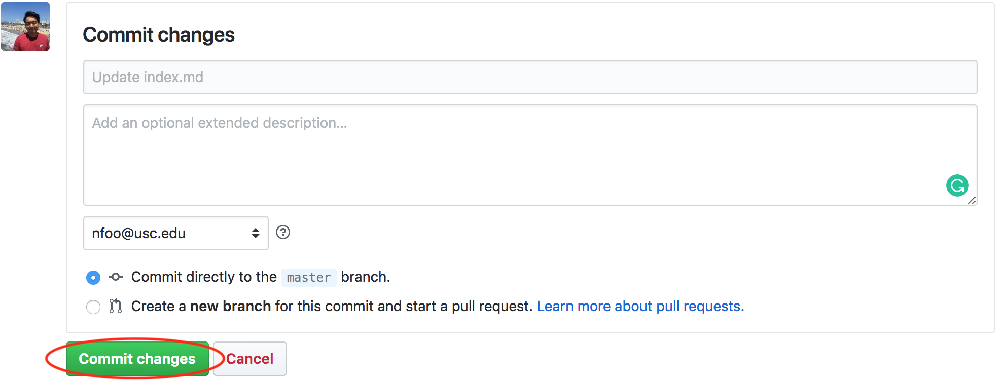

[Markdown Cheatsheet](https://github.com/adam-p/markdown-here/wiki/Markdown-Cheatsheet).

[GitHub Markdown Reference](https://help.github.com/articles/basic-writing-and-formatting-syntax/).

## Editing files

1. Log into [Github](https://github.com/).
2. Go into the CS104-Notes repository: [https://github.com/neutonfoo/cs104-notes](https://github.com/neutonfoo/cs104-notes).
3. Main topic pages are located in subfolders in `topic/`.

4. Page files are in named `index.md` within their respective folders.

5. Click the `index.md` file.
6. To edit, click the pencil icon on the top-right.

7. Topic pages are written in Markdown. To preview changes, click "Preview changes".

8. When changes are completed, scroll to the bottom of the page.
9. Click "Commit Changes".

10. Go to  to ensure changes are made. (Might take a minute to update.)
